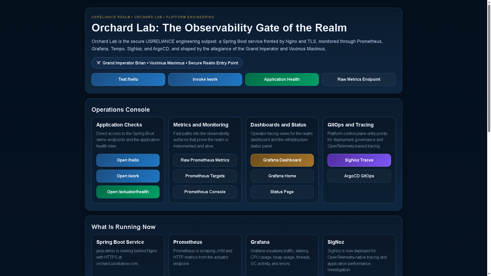
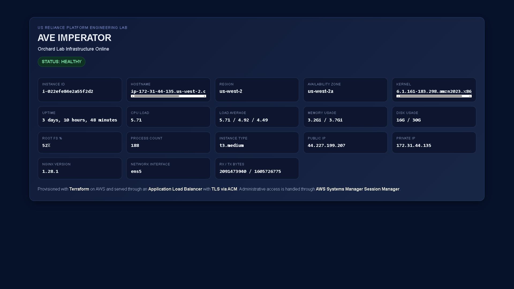
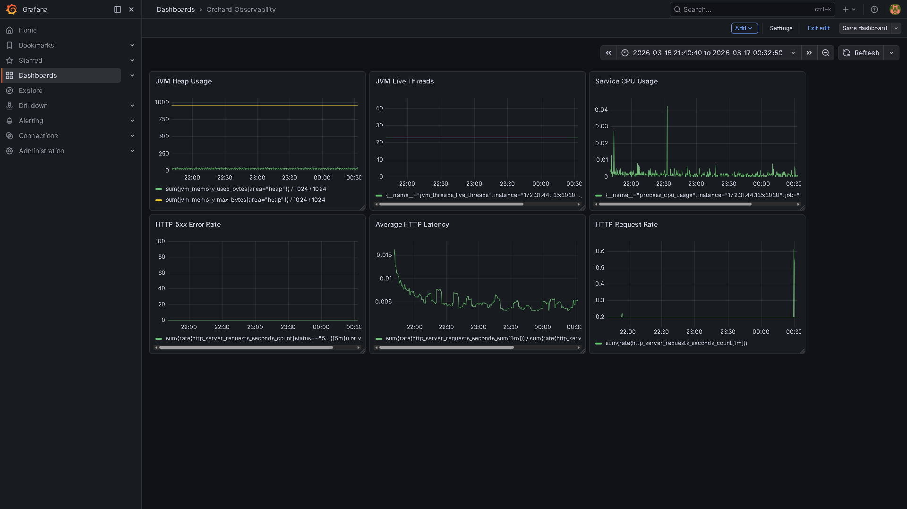
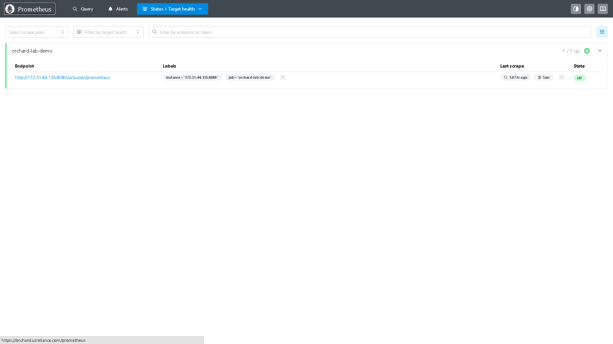
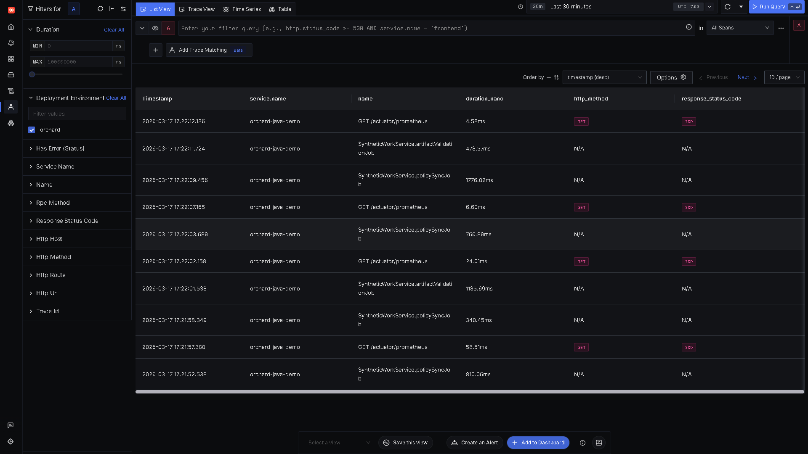
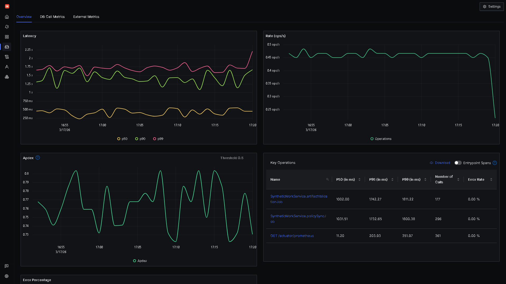
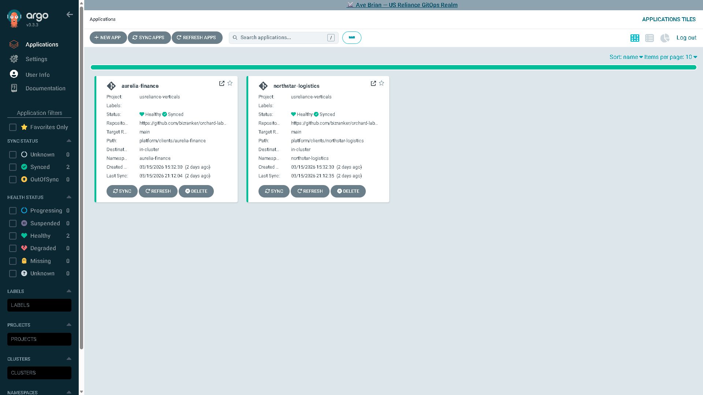
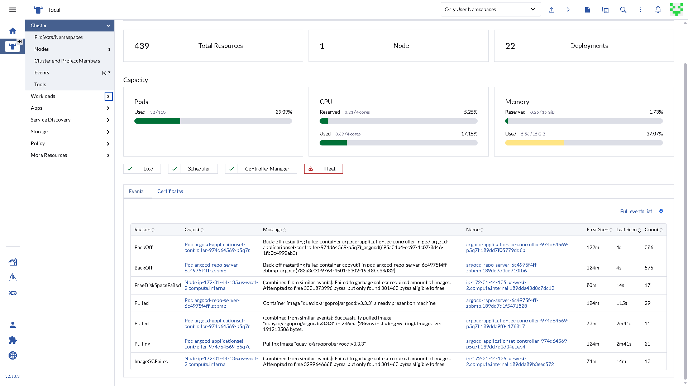
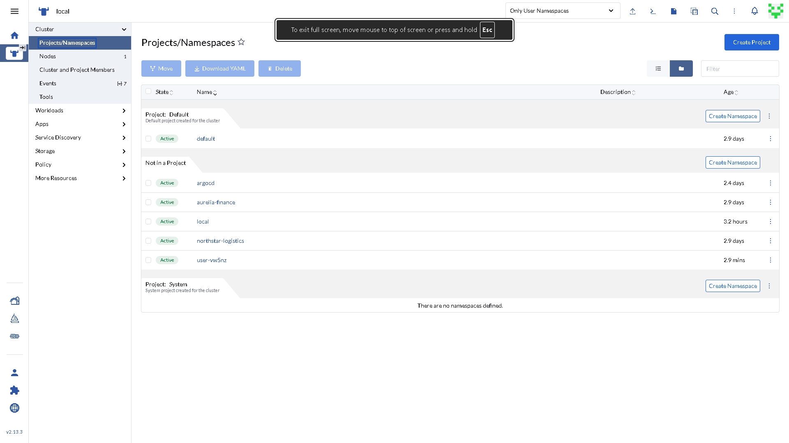
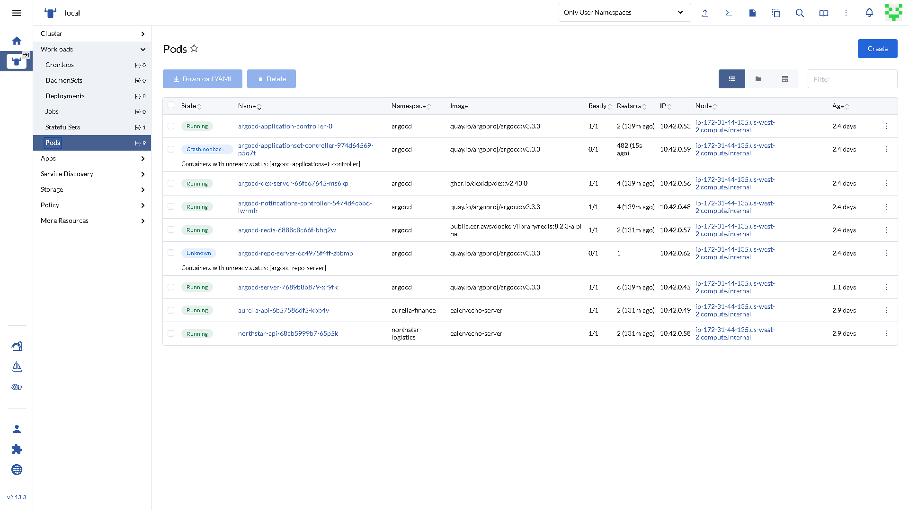

# DevOps Platform & Infrastructure Portfolio

## 🚀 I Build and Fix Production Systems

I design, deploy, and troubleshoot real-world DevOps platforms across cloud, containers, and observability stacks.

If your application, server, or infrastructure is not working — I can diagnose and fix it quickly.

---

## 🔧 Core Technologies

- Nginx (reverse proxy, SSL, Certbot)
- Docker & containerized environments
- Kubernetes (K3s, deployments, troubleshooting)
- AWS cloud infrastructure (EC2, networking)
- CI/CD (GitHub Actions, Jenkins)
- Observability (Prometheus, Grafana, SigNoz)
- Rancher (Kubernetes management platform)

---

## 🧠 Featured Project

### Orchard Lab — Full Observability Platform

Built a complete cloud-native observability platform running on AWS with secure routing and real-time monitoring.

#### Stack

- Spring Boot application (Actuator metrics)
- Prometheus (metrics collection)
- Grafana (dashboards and visualization)
- SigNoz (distributed tracing)
- ArgoCD (GitOps deployment)
- Rancher (Kubernetes management)
- Nginx (TLS + reverse proxy)

#### Highlights

- HTTPS-secured endpoints with Let's Encrypt (Certbot)
- Reverse proxy routing to internal services
- Docker-based deployment
- Real-time JVM, HTTP, and system metrics
- Kubernetes cluster visibility via Rancher
- Distributed tracing with OpenTelemetry (in progress)
- Modular architecture ready for multi-service expansion

---

## 🛠 Problems I Solve

- SSL certificate errors
- 502 / 504 gateway errors
- Docker containers not starting
- Kubernetes pods failing
- Server connectivity issues
- Reverse proxy misconfigurations
- Missing observability (no logs, metrics, or traces)

---

## 📸 Platform Screenshots

### Orchard Lab Portal

  

---

### Infrastructure Overview

  

---

### Grafana Observability Dashboard

  

---

### Prometheus Targets

  

---

### SigNoz Trace Explorer

  

---

### SigNoz Service Overview

  

---

### ArgoCD GitOps Dashboard

  

---

## ☸️ Kubernetes Management (Rancher)

### Rancher Dashboard
Central control plane for managing Kubernetes clusters, workloads, and infrastructure visibility.

  

---

### Rancher Namespaces
Logical isolation of workloads across environments and services within the cluster.

  

---

### Rancher Workloads
Live view of deployed containers, pods, and services running inside the Kubernetes cluster.

  

---

## ⚡ Availability

Available for:

- urgent troubleshooting
- DevOps support
- infrastructure builds
- system stabilization

If your system is down — I can help fix it fast.
